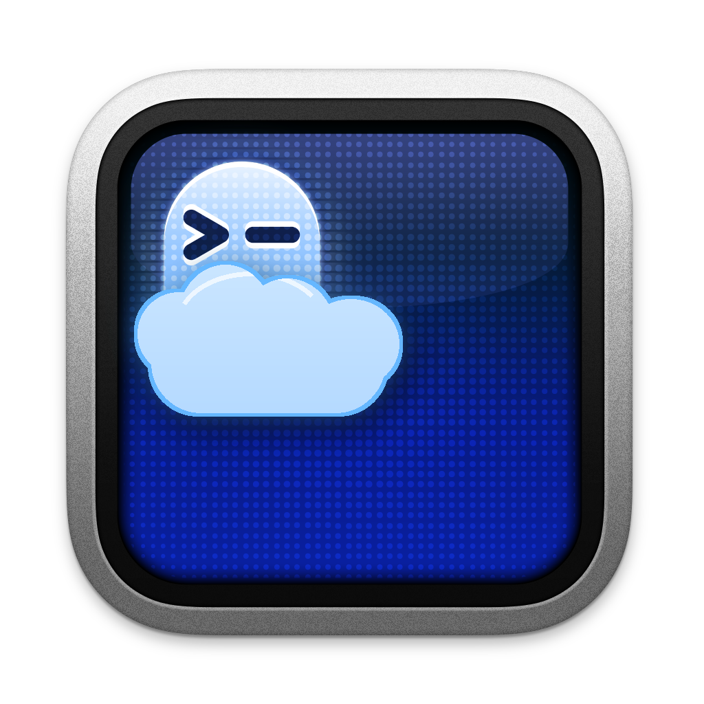
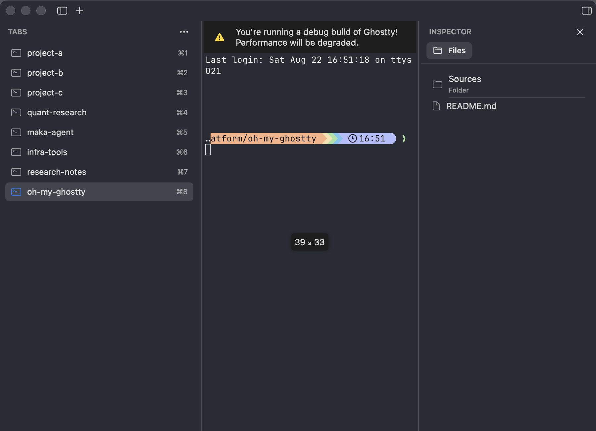

<p align="center">
  
</p>

<h1 align="center">OMG</h1>

<p align="center">
  A Ghostty-based macOS terminal with an extensible application shell.
  <br>
  Vertical tabs, a native Inspector, Files browsing, visual Settings, and
  host-owned extension boundaries without replacing the Ghostty terminal core.
</p>

<p align="center">
  <a href="https://github.com/jischeng/oh-my-ghostty/releases">Downloads</a>
  ·
  <a href="docs/PLUGIN_DEVELOPMENT.md">Plugins</a>
  ·
  <a href="docs/RELEASING.md">Releasing</a>
  ·
  <a href="docs/oh-my-ghostty-architecture.md">Architecture</a>
</p>



## What is OMG?

OMG is an independent macOS application built on the
[Ghostty](https://github.com/ghostty-org/ghostty) terminal core. Ghostty
provides terminal emulation, rendering, PTY/shell lifecycle, input, and the
configuration foundation. OMG adds an application layer designed for richer
native workflows and future extension points.

OMG is not an official Ghostty release. It uses its own application identity:

```text
Application:       OMG.app
Executable:        omg
Bundle identifier: com.jischeng.omg
```

It can be installed and run alongside the official `Ghostty.app` without
replacing it.

## Why OMG?

The goal is to extend the terminal application shell while preserving Ghostty's
core behavior and performance-sensitive paths. OMG keeps Horizontal tabs on
Ghostty's native implementation and adds optional presentation/integration
layers around the same canonical terminal model.

Core design rules:

- Ghostty owns renderer, PTY, terminal state, input, and shell lifecycle;
- `NSWindowTabGroup.windows` remains the canonical macOS tab model;
- native AppKit/SwiftUI owns application presentation;
- extension providers contribute validated data, not arbitrary views or
  terminal objects;
- OMG and Ghostty versions are tracked independently.

## Features

### Ghostty terminal core

- Ghostty renderer, terminal emulation, PTY, input, themes, and keybindings;
- Ghostty configuration remains the inherited terminal baseline;
- Horizontal layout continues to use Ghostty's native titlebar tabs.

### Vertical Tabs

- left session/tab Sidebar backed by the same `NSWindowTabGroup` order;
- tab selection, close, drag reorder, restore, and `⌘1...⌘9` behavior;
- project/date grouping and manual/created/recent ordering;
- shared window-group visibility and committed width state;
- terminal-safe show/hide and resize behavior.

### Right Inspector and Files

- Core-owned Inspector host shared by Horizontal and Vertical layouts;
- extensible titlebar pane switch with deterministic overflow;
- recursive Files tree following the selected tab's live working directory;
- incremental, cancellable subtree loading that preserves scroll, selection,
  expansion identity, and cached children;
- file/folder creation, refresh, collapse, and type-aware host icons;
- theme-derived backgrounds, separators, opacity, and vibrancy.

### Native Settings and appearance

- native macOS Settings window;
- OMG-owned tabs, appearance, terminal, keyboard, plugin, and advanced pages;
- optional theme/font/opacity/blur/cursor overrides layered on Ghostty config;
- live updates without rebuilding terminal surfaces;
- separate OMG settings file and typed schema.

### Extension foundation

OMG includes tested protocol, capability, status, and Inspector registry
components. The built-in Files provider dogfoods the typed Inspector boundary.
An Experimental in-tree SSH workspace provider reads OpenSSH aliases and uses
the system SFTP client for remote Files without owning credentials. Splitting
an active SSH Pane launches a new independent `omg +ssh` child from the original
OpenSSH argv and ready remote cwd, preserving config aliases, ProxyJump,
explicit options, and folder context without keystroke injection.

The built-in Agent Status integration recognizes Codex, Claude Code, Pi, Qoder
CLI, Reasonix, OMP, OpenCode, Amp, Antigravity, Cline, Copilot, Crush, Cursor
Agent, Droid, Grok, Hermes, Kimi, and Qwen Code through bundled manifests.
In Vertical Tabs, the highest-priority activity across every split replaces the
terminal/cloud icon with the OpenAI, Claude, or Pi glyph. Idle has no ring;
working uses a rotating quarter-circle progress indicator, while approval,
completion, and failure use the trailing status slot. Selecting a completed Tab
acknowledges it back to idle without losing agent identity. Horizontal Tabs remain the
unmodified Ghostty native presentation. Instance-scoped bounded OSC events follow
the owning Surface and also work in SSH when hooks are installed explicitly in
the remote account. Settings can export an auditable remote installer; OMG never
silently changes remote dotfiles. Agent command, hook, icon, and resume behavior
come from bundled, allowlisted manifests. With **Restore Windows and Agent
Sessions** enabled (the default), OMG restores every open window/tab/split and
uses an exact validated conversation ID whenever the Agent exposes a resumable
session API; Agents without one restart fresh in the same cwd. Local and SSH
restore share the same original SSH argv and typed allowlist. These
in-tree providers are not installable third-party plugins.
A public third-party executable loader is **not implemented yet**; see
[Plugin Development](docs/PLUGIN_DEVELOPMENT.md) for exact Stable,
Experimental, Internal, and Planned status.

## Installation

Download the architecture-specific DMG from
[GitHub Releases](https://github.com/jischeng/oh-my-ghostty/releases):

- `OMG-<version>-macos-arm64.dmg` for Apple Silicon;
- `OMG-<version>-macos-x86_64.dmg` for Intel Macs.

Drag `OMG.app` to Applications. Because the bundle identifier and executable
are independent, official Ghostty and OMG can coexist.

Release notes state whether an artifact is Developer ID signed and notarized.
Do not assume an unnotarized development build has the same Gatekeeper behavior
as a final distribution build.

## Relationship with Ghostty

OMG is based on Ghostty and retains its license/attribution. The exact base is
recorded in every app bundle and release:

```text
OMG <OMG_VERSION>
Based on Ghostty <GHOSTTY_VERSION>
Ghostty revision <GHOSTTY_REVISION>
```

OMG SemVer controls OMG release/update ordering. A Ghostty synchronization
updates the separate base fields and increments OMG normally; it never embeds
the Ghostty version into SemVer precedence.

Upstream project:

- source: <https://github.com/ghostty-org/ghostty>
- documentation: <https://ghostty.org/docs>

## Plugins

The current running application supports host-owned status presentation and
in-process typed Inspector providers. The process protocol codec,
authorization policy, manifest model, and status router are tested but are not
connected to discovery, a socket server, or a supervised external executable.

An Experimental `PluginInstallationManager` can store a validated GitHub
`manifest.json` package under OMG Application Support and keep plugin data in a
separate directory. Installed packages are currently inert: there is no public
install command/UI, executable loader, process supervisor, hot reload, or
third-party SDK. Do not treat protocol types or storage installation alone as a
production plugin runtime.

See [Plugin Development](docs/PLUGIN_DEVELOPMENT.md) for:

- current manifest and wire shapes;
- lifecycle and capability status;
- Inspector provider reference;
- permissions/security limitations;
- a working in-tree provider test;
- the required documentation maintenance rule.

## Development

### Prerequisites

- macOS with Xcode command-line tools;
- Zig 0.16.0 (examples use `mise`);
- SwiftLint;
- Nushell for the macOS wrapper.

### Build GhosttyKit

Required after Zig/core/build changes and on a clean checkout:

```bash
env -u http_proxy -u https_proxy -u HTTP_PROXY -u HTTPS_PROXY \
  -u ALL_PROXY -u all_proxy \
  mise exec zig@0.16.0 -- zig build \
    -Doptimize=ReleaseFast \
    -Demit-xcframework=true \
    -Dxcframework-target=native \
    -Demit-macos-app=false \
    -Dversion-string=1.3.2-dev
```

Use the current `GhosttyBaseVersion` value instead of copying the example when
the upstream base changes.

### Build and test the macOS app

```bash
macos/build.nu --scheme Ghostty --configuration Debug --action build
macos/build.nu --scheme Ghostty --configuration Debug --action test
```

Output:

```text
macos/build/Debug/OMG.app
```

The Xcode target/scheme and Swift module retain the internal name `Ghostty` for
upstream compatibility. The shipped product remains `OMG.app`. Install local
builds only as `/Applications/OMG Dev.app`; Debug uses a separate bundle ID and
separate mutable storage, so development builds do not overwrite the stable
`/Applications/OMG.app` terminal or its settings, restoration, plugins, and SSH
replay state.

Project commands and validation requirements are also documented in
`AGENTS.md` and `macos/AGENTS.md`. Validate documentation links, protocol
version references, required scripts, and privacy-sensitive patterns with:

```bash
python3 dist/check_omg_docs.py
```

## Build and release

Maintainers must follow [Releasing OMG](docs/RELEASING.md). It defines:

- Development and local Release builds;
- arm64/x86_64 isolation;
- OMG/Ghostty dual versioning;
- validation gates;
- Developer ID signing and notarization;
- DMG packaging and checksums;
- merge, tag, and GitHub Release rules;
- updater limitations and privacy-safe secret handling.

The inherited upstream Ghostty release workflows are not the OMG release path.

## Roadmap

Planned work, not current features:

- supervised out-of-process plugin discovery/loading and permissions;
- public plugin package/install/update lifecycle;
- external Inspector and status wire messages;
- Git and SSH Inspector panes;
- official agent adapters and QuickInput/Pi integration;
- dedicated signed/notarized CI and OMG Sparkle appcast;
- additional developer and remote-workflow tools.

See [Plugin Capability Audit](docs/plugin-capability-audit.md) for implementation
gaps and [Architecture](docs/oh-my-ghostty-architecture.md) for design context.

## Credits

OMG is built on Ghostty. Ghostty was created by Mitchell Hashimoto and the
Ghostty contributors. This fork preserves upstream copyright, license, and
attribution. OMG is not affiliated with or endorsed by the official Ghostty
project.

## License

This repository remains under the [MIT License](LICENSE):

```text
Copyright (c) 2024 Mitchell Hashimoto, Ghostty contributors
```

The copyright notice and license terms must remain with copies or substantial
portions of the software.
